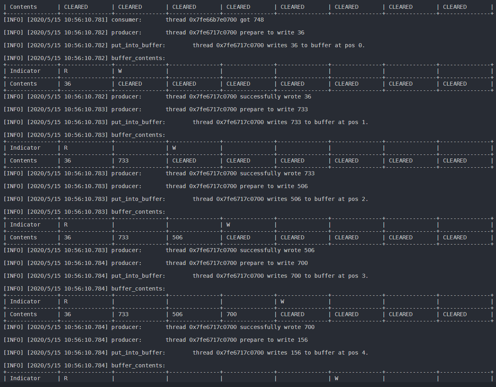

# 处理机管理-生产&消费 设计方案报告

## 学生信息

Name | Student ID
-|-
熊云鹏 | 1850121

## 运行说明

编写时的环境为 WSL 1，使用 gcc 7.5.0 编译，编译参数中至少包含 ```-pthread``` 。

```reStructuredText
gcc (Ubuntu 7.5.0-3ubuntu1~18.04) 7.5.0
Copyright (C) 2017 Free Software Foundation, Inc.
This is free software; see the source for copying conditions.  There is NO
warranty; not even for MERCHANTABILITY or FITNESS FOR A PARTICULAR PURPOSE.
```

```reStructuredText
nemo@marshmallow-laptop
-----------------------
OS: Ubuntu 18.04.4 LTS on Windows 10 x86_64
Kernel: 4.4.0-18362-Microsoft
Uptime: 4 days, 5 hours, 32 mins
Packages: 854
Shell: zsh 5.4.2
Terminal: vscode
CPU: Intel i5-8300H (8) @ 2.304GHz
Memory: 12806MiB / 16240MiB
```

如果一切正常的话，当参数中包含 ```-Wall``` 的时候编译器不会提示有任何警告和错误；若出现任何警告和错误，请您检查您的环境。


请注意：如果使用 ```Mingw-w64```，您可能需要在参数中添加 ```-std=c11``` ，否则编译器会报错；同时，编译器可能会报告如下警告：

```reStructuredText
warning: format '%lx' expects argument of type 'long unsigned int', but argument 2 has type 'pthread_t' [-Wformat=]
```

这个警告可以安全地被忽略。在实际运行过程中，只观察到线程 ID 的格式略有不同，且不影响展示效果。

在目录下，已经提供了预编译的二进制文件供使用。

如果您想要自行编译，可以使用提供的 ```Makefile```。

```bash
make clean && make
```


## 描述

* 默认配置为有界缓冲区内设有 8 个整型存储单元，2 个生产者，4 个消费者。这些配置可以在 ```variables.h``` 中更改。请注意：在更改后您需要重新编译。
* 每个生产者和消费者对有界缓冲区进行操作后，打印表格来即时显示有界缓冲区的全部内容和当前读/写指针位置。同时，读写时也会打印消费者/生产者进程的线程标识符（十六进制形式）。
* 多个生产者或多个消费者之间有共享对缓冲区进行操作的函数代码。
* 每个操作均会打印一条时间信息，方便参考。
* 请注意，一个制表符为 8 个空格。若想要将内容输出到文件，请在您的文本编辑器中设定 Tab 的渲染形式为 8 个空格。

## 流程描述

### 总体

```c
// create buffer, producers and consumers
create_buffer(BUFFER_SIZE);
create_producers_and_consumers(PRODUCER_QUANTITY, CONSUMER_QUANTITY);
// detach and run
run_producers();
run_consumers();
// join
join_producers();
join_consumers();
clean_up();
```

### 生产者

```c
// wait till it can be written, and can get lock
wait(can_be_written && mutex_lock);
write(value);
signal(can_be_read);
// release lock
signal(mutex_lock);
```

### 消费者

```c
// wait till it can be read, and can get lock
wait(can_be_read && mutex_lock);
write(value);
signal(can_be_written);
// release lock
signal(mutex_lock);
```

## 程序运行截图





